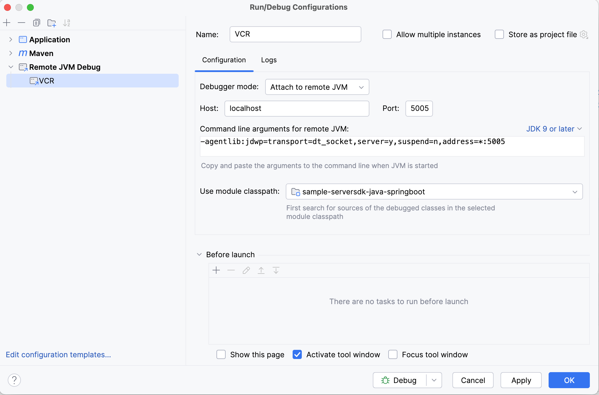

# Vonage Java Server SDK SpringBoot Demo App

This repo demonstrates usage of the [Vonage APIs](https://developer.vonage.com/en/api)
using the [Vonage Java Server SDK](https://github.com/Vonage/vonage-java-sdk). It is built
as a Spring Boot 3 web application.

The purpose of this is to provide an interactive demo for our APIs.
Unlike the [Java code snippets repo](https://github.com/Vonage/vonage-java-code-snippets),
you can see the snippets in action live without an IDE or local setup!

## Pre-requisites
You will need Java Development Kit 17 or later to run this demo.
Installation instructions can be found [here for Temurin JDKs](https://adoptium.net/en-GB/installation/) or
[here for Oracle JDK 21](https://docs.oracle.com/en/java/javase/21/install/overview-jdk-installation.html).

You also need a Maven installation. You can download this from [here](https://maven.apache.org/download.cgi) and
add it to your PATH, or install via your OS's package manager - e.g. `brew install maven` for Homebrew on macOS
or `choco install maven` for Chocolatey on Windows.

## Configuration
All the parameters required to run the demo can be provided through environment variables. These are as follows:

- `VONAGE_API_KEY`: Vonage account API key.
- `VONAGE_API_SECRET`: Vonage account API secret.
- `VONAGE_APPLICATION_ID`: Vonage application UUID.
- `VONAGE_PRIVATE_KEY_PATH`: Absolute path to the private key associated with your Vonage application.
- `VCR_PORT`: Port to run the demo on. By default, this is `8080`.

Other parameters can be provided for convenience or defaults for pre-populating certain fields. These are:

- `TO_NUMBER`
- `FROM_NUMBER`
- `TO_EMAIL`
- `FROM_EMAIL`
- `VONAGE_WHATSAPP_NUMBER` - used as the sandbox `from` value for WhatsApp
- `VONAGE_VIBER_ID` - used as the sandbox `from` value for Viber
- `VONAGE_MESSENGER_ID` - used as the sandbox `from` value for Facebook Messenger

## Build & Run
If you have [IntelliJ IDEA](https://www.jetbrains.com/idea/) installed, you can import this project
and run it through the IDE, where the entry point is the `Application` class
(src/main/java/com/vonage/sample/serversdk/springboot/Application.java).

To run the demo standalone from the command line, do `mvn install spring-boot:run`.
Then open a browser to [localhost:8080](http://localhost:8080) to use the application.

## VCR Deployment
This demo is designed to be deployed to [Vonage Cloud Runtime (VCR)](https://developer.vonage.com/en/vcr/overview).
You need to [install the VCR CLI](https://github.com/Vonage/cloud-runtime-cli?tab=readme-ov-file#installation),
and [configure it](https://github.com/Vonage/cloud-runtime-cli/blob/main/docs/vcr.md).

Make sure the project is built using `mvn clean install`. Then run `vcr deploy --app-id $VONAGE_APPLICATION_ID`.
The manifest for VCR deployment is defined in [vcr.yml](vcr.yml).

## VCR Debugging
The application can also be debugged with an IDE even while running on VCR, using a remote debugger.
Run `vcr debug --app-id $VONAGE_APPLICATION_ID`. The JVM will suspend until you attach a debugger to it.

Instructions for setting up remote debugging will vary depending on your IDE, but for IntelliJ, you
can use the following configuration:

